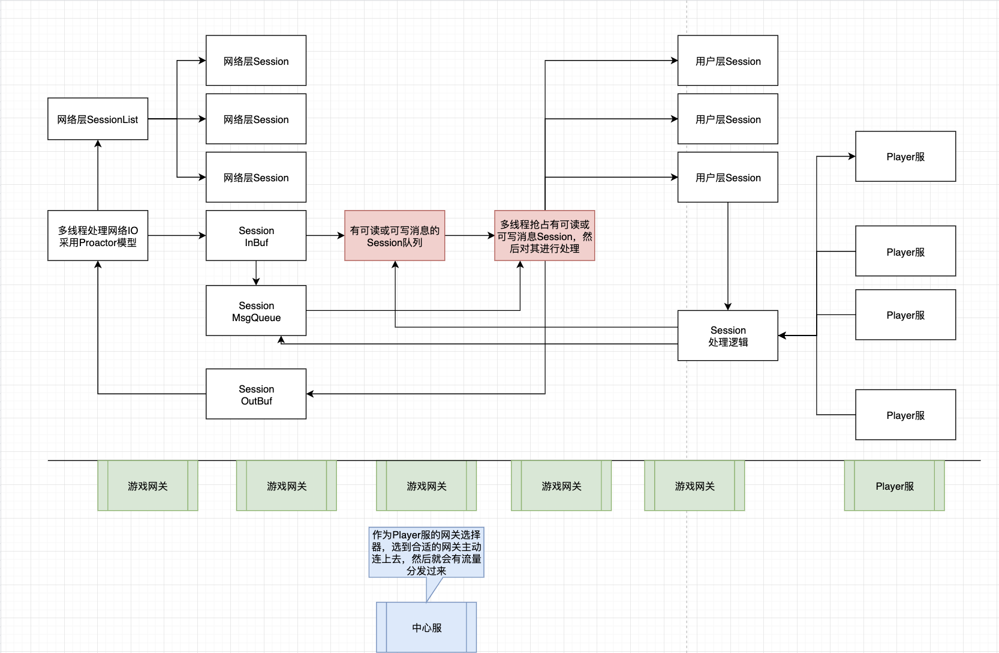

# f1985gfw
High performance game server framework and tool chain.

- building and installing dependent
    - First, you should install automake, autoconf, libtool and cmake
    - At ubuntu platform, maybe you need to execute command 
        ```bash
        apt install automake autoconf libtool cmake
        ```
    - At macosx platform, maybe you need to execute command
        ```bash
        brew install automake autoconf libtool cmake
        ```   
    ```bash
    mkdir ${PWD}/dependent

    wget https://boostorg.jfrog.io/artifactory/main/release/1.78.0/source/boost_1_78_0.tar.gz
    tar -zxvf boost_1_78_0.tar.gz
    pushd boost_1_78_0
    ./bootstrap.sh --prefix=${PWD}/../dependent/boost
    ./b2
    ./b2 headers
    ./b2 install
    popd
    
    wget https://github.com/protocolbuffers/protobuf/releases/download/v21.7/protobuf-cpp-3.21.7.tar.gz
    tar -zxvf protobuf-cpp-3.21.7.tar.gz
    pushd protobuf-3.21.7
    ./autogen.sh
    ./configure --prefix=${PWD}/../dependent/protobuf
    make
    make install
    popd

    wget https://github.com/nlohmann/json/archive/refs/tags/v3.11.1.tar.gz
    tar -zxvf v3.11.1.tar.gz
    pushd json-3.11.1
    mkdir build && cd build
    cmake -DCMAKE_INSTALL_PREFIX=${PWD}/../../dependent/json ../
    make
    make install
    popd
    ```

- build project
    ```bash
    git clone git@github.com:samoyedsun/f1985gfw.git
    cd f1985gfw
    ../dependent/protobuf/bin/protoc ./proto/* --proto_path=./proto --cpp_out=./server/message --cpp_out=./client/message
    
    # WORK f1985gfw
    cd server && mkdir build
    cd build && cmake ../
    
    # WORK f1985gfw
    cd client && mkdir build
    cd build && cmake ../
    ```
    
    
# TODO
- 想着加入ecs的概念
- 建立连接时 用户层创建RoleComponent设置到内核层的connection，每个RoleComponent有自己的消息队列
- 收到消息时 解析消息投递到RoleComponent的消息队列
- 关闭连接时 用户层删除RoleComponent
- 还有公共Component, 比如SceneComponent
- 以后尝试加用boost异步加rpc,

# Frame Diagram
